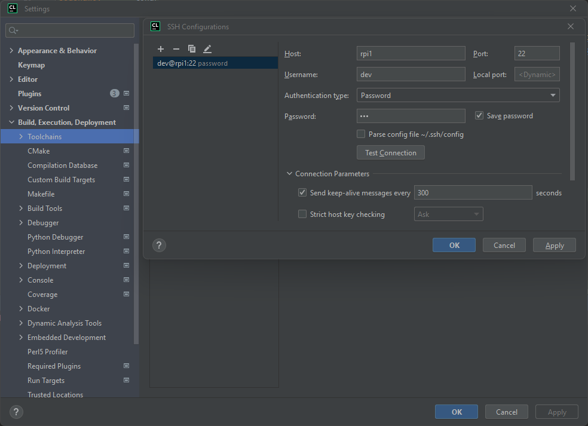
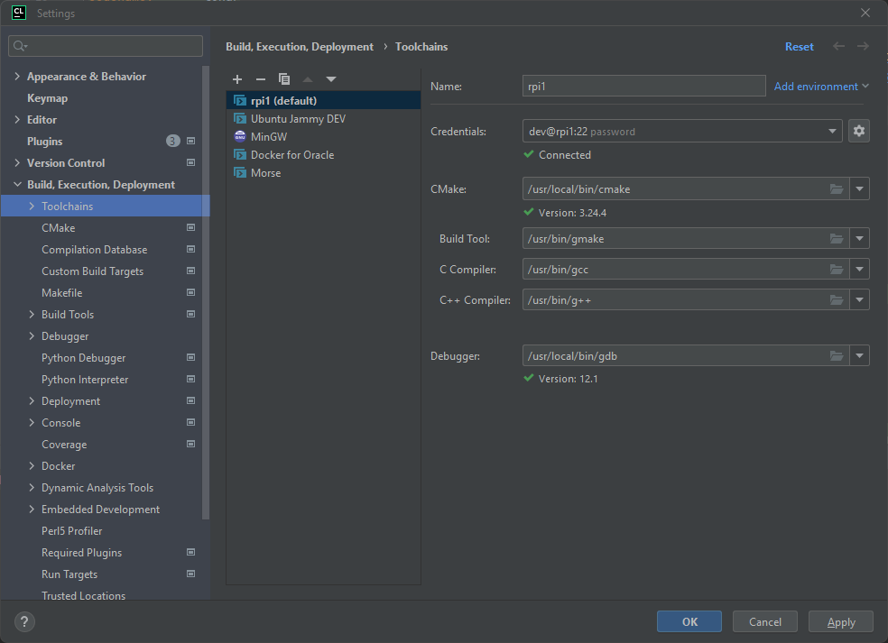
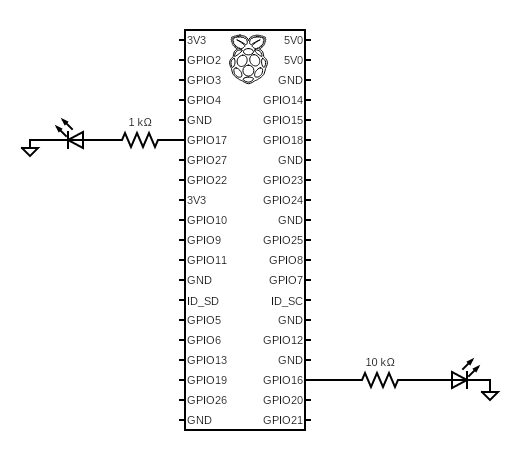
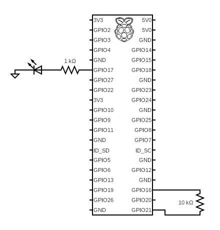

# CLION with Raspberry PI

This document describes the configuration of a Raspberry Pi for CLION (version `2022.3.2`) full remote development.

It also provides simple examples that shows how to use the [libGpiod library](https://git.kernel.org/pub/scm/libs/libgpiod/libgpiod.git/about/) (with threads).

## Hardware specification:

Raspberry Pi `3` Model B Rev `1.2` (32 bits).

```bash
$ cat /sys/firmware/devicetree/base/model
Raspberry Pi 3 Model B Rev 1.2
$ uname -m
armv7l # => 32 bits (see: https://forums.raspberrypi.com/viewtopic.php?t=251721) 
```

## OS specification

Ubuntu server `23.04`.

```bash
$ lsb_release -a
No LSB modules are available.
Distributor ID: Ubuntu
Description:    Ubuntu 23.04
Release:        23.04
Codename:       lunar
```

> Please, make sure to activate the _SSH login_ when you generate the OS image (using [Raspberry PI Imager](https://www.raspberrypi.com/software/)).
> See this document: [How to Set Up a Headless Raspberry Pi, Without Ever Attaching a Monitor](https://www.tomshardware.com/reviews/raspberry-pi-headless-setup-how-to,6028.html).

## Install the compilation environment

We need CMAKE version `3.24.4` and GDB version `12.1` (because we use CLION `2022.3.2`).

### CMAKE

Install CMAKE dependencies:

```bash
sudo apt install g++
sudo apt install libssl-dev
```

Then install CMAKE:

```bash
cd /tmp
wget https://github.com/Kitware/CMake/archive/refs/tags/v3.24.4.tar.gz
tar zxvf v3.24.4.tar.gz
cd /tmp/CMake-3.24.4
./bootstrap && gmake && sudo make install
cd /tmp
rm -rf /tmp/CMake-3.24.4 v3.24.4.tar.gz
```

> This installation takes a lot of time...

### GDB

Install GDB dependencies:

```bash
sudo apt install libgmp-dev
```

Then install GDB:

```bash
cd /tmp
wget https://ftp.gnu.org/gnu/gdb/gdb-12.1.tar.gz
tar zxvf gdb-12.1.tar.gz
cd gdb-12.1
./configure
make
sudo make install
cd /tmp
rm -rf gdb-12.1 gdb-12.1.tar.gz
```
## CLION configuration

Assuming that:
* the hostname of the Raspberry is `rpi1`.
* the login is `dev`.





## Install the libGpiod library

```bash
apt install gpiod libgpiod-dev libgpiod-doc
```

> At this point, you should resynchronise the CLION's copy of the remote file system with the remote file system
> itself. To do that click on `Tools` => `Resync with Remote Hosts` (see [this document](https://www.jetbrains.com/help/clion/remote-projects-support.html#resync) for details).

Test the installation:

```bash
echo "#include <gpiod.h>"$'\n'"int main(){return 0;}" | gcc -xc -
echo "int main(){return 0;}" | gcc -xc -lgpiod -
echo | gcc -E -Wp,-v - | grep -v "# "
```

Get the GPIO chip receiver_name:

```bash
$ gpiodetect
gpiochip0 [pinctrl-bcm2835] (54 lines)
gpiochip1 [brcmvirt-gpio] (2 lines)
gpiochip2 [raspberrypi-exp-gpio] (8 lines)
```

> See [this link](https://www.raspberrypi.com/documentation/computers/processors.html): the Raspberry Pi 3 Model B uses
> the `BCM2837` chip (not the `BCM2835`). However, the underlying architecture of the BCM2837 is identical to the `BCM2836`.
> And The underlying architecture of the `BCM2836` is identical to the `BCM2835`.

# Useful commands

```bash
gpiofind "GPIO17"
gpioset `gpiofind "GPIO17"`=0
gpioget  `gpiofind "GPIO17"`
sudo gpioinfo gpiochip0
gpioset --mode=time --sec=3 `gpiofind "GPIO17"`=1
gpioset --mode=time --sec=3 -b `gpiofind "GPIO17"`=1
```

## Examples using libGpiod

### Example 1



See [this code](gpio1.c).

### Example 2



See [this code](gpio2.c).